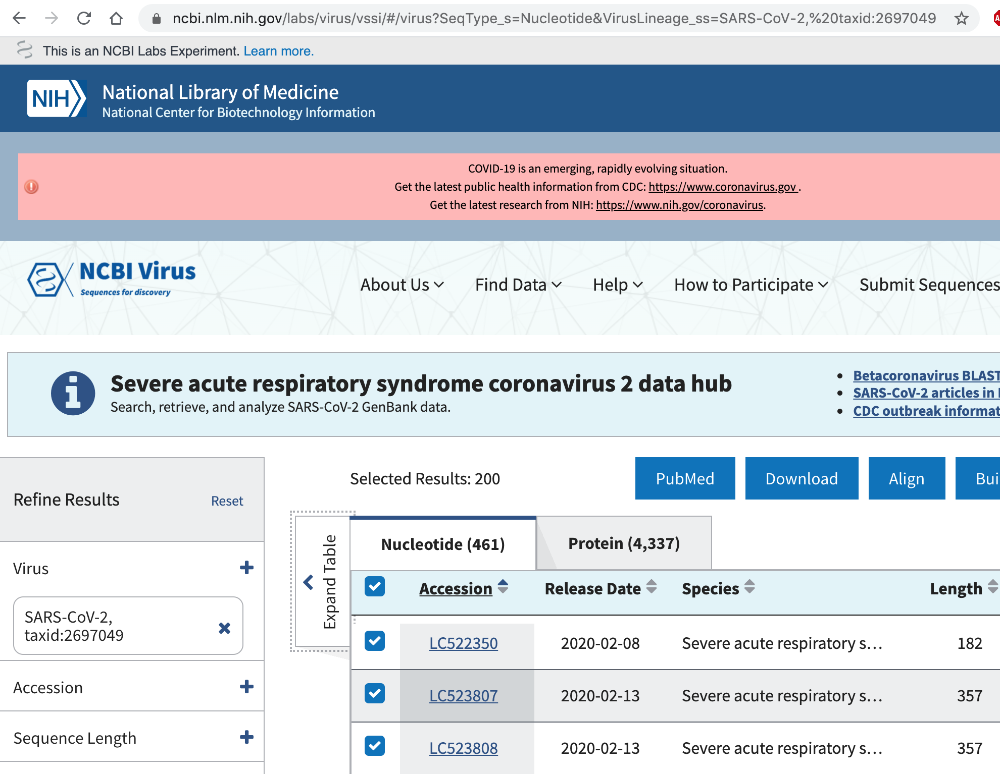

# Motivation

* Have sequences from some region.  Examples: immune repertoire, germline variation, viral genomes.
* Or perhaps homologs from various species.
* Want to explore similarities/differences between sequences.  Could be used to cluster them, or generate a phylogeny.
* If there is a reference, can ask how important a difference is
  * If in a gene, does it alter protein coding?
  * Is it in an evolutionarily conserved region?
  
# Learning objectives

1.  Query and manipulate genomic information in R, e.g. genes and transcripts
2.  Manipulate sequences
3.  Align and cluster sequences

# Everybody's favorite least favorite topic



We'll download all the SARS-COV-2 sequences that have been submitted to [NCBI's genbank](https://www.ncbi.nlm.nih.gov/labs/virus/vssi/#/virus?SeqType_s=Nucleotide&VirusLineage_ss=SARS-CoV-2,%20taxid:2697049)

The recipe for doing this is in the appendix.

# Load FASTAs

```{r, echo = TRUE}
knitr::opts_chunk$set(cache = TRUE, autodep = TRUE, echo = TRUE)
suppressPackageStartupMessages({
  library(Biostrings)
library(dplyr)
library(ggplot2)
library(stringr)
library(GenomicRanges)
library(forcats)
library(ggdendro)
library(ggrepel)
})
# also need rtracklayer, msa
# BiocManager::install(c('Biostrings', 'dplyr', 'ggplot2', 
# 'stringr', 'GenomicRanges', 'rtracklayer', 'seqLogo', 'Mus.musculus', 'forcats', 'ggdendro', 'ggrepel'))

fasta = readDNAStringSet('data/ny_nt_2022.fasta')
genome = readDNAStringSet('data/sars-cov2-genome.fasta')
```

We'll load a random sample of the SARS-COV2 genomic sequences that have been submitted from New York State as of 7-April-2022, as well as the reference genome as `DNAStringSets`.

***

Taking a look at these, they are a Bioconductor S4 object, [with a rich set of operators](https://bioconductor.org/packages/release/bioc/vignettes/Biostrings/inst/doc/BiostringsQuickOverview.pdf) that allow them to be subset, matched, and statistics calculated upon them.

```{r}
fasta
```

There are `r length(fasta)` sequences.

```{r}
summary(width(fasta))
genome
```
We are working with full-length sequences.   The refence genome is `r width(genome)` bp in length.

# Visualize genomic features

Let's see how the coding regions are arrayed.

```{r}
anno = rtracklayer::import('data/sars-cov2.gff.gz')
anno_df = filter(as.data.frame(anno), type %in%  c('gene', 'five_prime_UTR', 'three_prime_UTR'))
anno_plot = ggplot(anno_df, aes(ymin = start, ymax = end, x= Name, color = type)) +
  geom_linerange(lwd = 3) + coord_flip() + theme_minimal()

anno_plot
```

This is OK, but the "Names" are sorted in reverse alphabetical order -- not a useful sort order.  To sort them by starting position, in ggplot, we need to tell R that they are a factor, and set the factor "order" to correspond to the `start` position.

***

```{r}
anno_df = anno_df %>% mutate(Namef = fct_reorder(factor(Name), start, .fun = min))
(anno_plot %+% anno_df) + aes(x = Namef)
```

Note that in many cases your efforts might be better spent first using the [ucsc genome browser](https://genome.ucsc.edu/cgi-bin/hgTracks?db=wuhCor1&lastVirtModeType=default&lastVirtModeExtraState=&virtModeType=default&virtMode=0&nonVirtPosition=&position=NC_045512v2%3A1%2D29903&hgsid=821382083_Elmbs8zUZtJi7b3n4xmm5wGCaWaK).

# Using genomic information for other organisms

In the case of SARS-COV-2, I had to download a gff file with the annotations from NCBI. But in most cases a GenomicRanges object will already exist.  For instance, for mouse:

```{r}
library(Mus.musculus)
my_entrezid = AnnotationDbi::select(org.Mm.eg.db, 'Itgax', columns = "ENTREZID", keytype = 'SYMBOL')
Itgax_region = exonsBy(TxDb.Mmusculus.UCSC.mm10.knownGene, 'gene')[[my_entrezid$ENTREZID]]
Itgax_region
```

Note that warning about `select` being masked!  If you are using `dplyr` you will need to fully-qualify it with `dplyr::select`.

Here we first access the `OrgDb` for mouse, and get the `ENTREZID` (the "column" returned) for the Itgax gene `SYMBOL`.  The `OrgDB` objects are databases -- you can see which keys you can search with `keytypes(org.Mm.eg.db)`, and what variables can be returned with `columns(org.Mm.eg.db)`.

Then we get all the exons for that ENTREZID id as a `GenomicRanges` object.

# Exercise

1.  In Mus Musculus, determine how many different versions of transcript exist for the gene *Ptprc* (CD45).  Extra credit: plot with `ggbio::autoplot`.


# Alignment

The fasta are fragments, starting  and stopping at undefined positions in the SARS-COV2 genome.  To do further analysis we need to put them on a common coordinates.  We can do that by either aligning to a reference (fast) or constructing a denovo multiple alignment (slow, possibly intractable).

[Usearch](https://drive5.com/usearch/manual/cmds_all.html) is an extremely flexible and fast shell tool for aligning/searching/clustering sequences.  It's well worth installing a copy and learning how to use it if you need to do large-scale manipulation of sequences.  Unfortunately, it is closed source, so if the documentation doesn't explain something, you have to trust that the author has implemented it correctly.  Open-sourced alternatives are available in `blast` or `cdhit.`

```{sh, eval = FALSE}
usearch -usearch_global data/ny_nt_2022.fasta -db data/sars-cov2-genome.fasta \
-nastout outputs/ny_nt.nast -strand plus -id .7

```

The command above aligns all the .fasta against the reference genome, and write out an aligned fasta file with each sequence the same length.

***

## Global vs local alignment

> An alignment [uses] basic  operations that transforms a query into a reference. There are 3 different kinds of basic operations: "insertions" (gaps in query), "deletions" (gaps in reference), "replacements."

-`?pairwiseAlignment` man page

In our command chunk below, the most important parameter is `-usearch_global`, specifying a global alignment.

```{sh, eval = FALSE}
usearch -usearch_global data/ny_nt_2022.fasta -db data/sars-cov2-genome.fasta  \
-nastout outputs/ny_nt.nast -strand plus -id .7
```

This means that a penalty is paid for every base in the query (`data/ny_nt_2022.fasta`) that doesn't align to the reference `data/sars-cov2-genome.fasta`.

```{r}
query = c('Txe rat can',
            'The rat can',
          'The ran')
reference = 'The cat ran'
pairwiseAlignment(query[1], reference, type = 'global')
```

The score here is a function of the number of matches (8) using particular scoring matrix (that should be tuned for the sequence type, eg, DNA vs Amino Acid).

```{r}
pairwiseAlignment(query[3], reference, type = 'global')

```
Now pay a penalty for opening the gap in the middle of the query.

***

In contrast, a local alignment looks for the highest scoring substring in query and reference, truncating each if mismatches or gaps outweigh the benefit of matching.
```{r}
pairwiseAlignment(query[1], reference, type = 'local')
pairwiseAlignment(query[2], reference, type = 'local')
```

There are also variants of local alignments that require minimum overlaps, or of global alignments that change the end-gap penalties.

***

In principle, one could use `R` to align to a reference (see `pairwiseAlignment` or `stringDist`).  This would be slow given the number and length of sequences we're considering, but works fine for a few dozen sequences.

```{r}
ralign = pairwiseAlignment(fasta[1:10], genome, type = 'overlap')
aligned(ralign,degap = FALSE, gapCode = '-', endgapCode = '+')
```

The above code takes about a couple minutes to run, so figure that 400 sequences would take around an hour.

***

# Exercises

2.  Consider the sequences
```r
query = 'The ran'
reference = 'The cat ran'
```
Can you modify the gap penalties so that "ran" is included in a **local alignment**?

3. Given equal gap and mismatch penalties, does the best local alignment ever return a worse score than the best global alignment?


## Multiple alignments

In the above, each sequence is aligned in turn to a reference. But in other cases, we might want to define a reference or a consensus using all sequences simultaneously. This is called a multiple alignment. It scales very poorly in the number of sequences.  `kalign` is among the state of the art.

```{sh, eval = FALSE}
kalign -i data/ny_nt_2022.fasta -o outputs/kalign_large.out
```

This takes several hours, compared to ~20 seconds for `usearch.`

## Pairwise alignments

Previously, we aligned each of the queries to a reference, but we can also align each query to every other query giving $n(n-1)/2$ possible pairs of alignments.  This can be done using global or local methods.  It's slow and memory intensive, so instead greedy approaches can be taken to cluster sequences into equivalence classes.  `usearch` and `cdhit` are among the state of the art for this.

# Other organisms

In many other cases, the sequences are already aligned to a reference, in which case, the batteries are generally included for downstream analysis.  If you can get a VCF file, containing the variants X samples, you are golden.  

See [this workflow](https://bioconductor.org/packages/release/workflows/vignettes/variants/inst/doc/Annotating_Genomic_Variants.html) for details about how to pull out a specific gene or genes from existing annotations.

# Read padded, aligned sequences

```{r}
aligned = readDNAStringSet('outputs/ny_nt.nast')
aligned
```

In any case, the output is also a FASTA file, but now each sequence is the same length, padded with `-` characters where the sequences were of differing lengths.  The `-` represent beginning/trailing or internal gaps.  The former are not penalized in the alignment since they just reflect that each sequence may cover a different "window".  The   internal gaps, representing deletions in the query sequence, are penalized.


# Digression--figuring out how to manipulate S4 objects.

Suppose someone handed you an S4 (Bioconductor) object and didn't write a very good manual.  How could you figure out what you could do with it?

```{r}
str(aligned)
slotNames(aligned)
```

You can examine it with `str` and `slotNames`.  However, in this case the `externalptr` business means nothing good will come of poking at its slots manually.

You can find out all known methods that take this object as input with something like this:

```{r}
showMethods(classes = class(aligned), where = 'package:Biostrings')
```

The `where = 'package:Biostrings'` can be omitted, at the cost of some irrelevant results being returned.

# Manipulating padded alignments

We can use these padded alignments to calculate consensus sequences and look for polymorphism.  For instance, let's look at the first 20 bp of the Spike gene.

```{r}
# First 20 bp of S gene
s_only = narrow(aligned, anno_df[which(anno_df$Name=='S'), 'start'], 
                end =  anno_df[which(anno_df$Name=='S'), 'start']+20)

s_only
```

Now we have `r length(s_only)` sequences of length 20.

***

```{r}
cm = consensusMatrix(s_only,  baseOnly = TRUE)[1:4,]
normalized = t(t(cm)/colSums(cm))
seqLogo::seqLogo(normalized)
```

We'll get the distribution of A, C, G,T at each of the 20 bases in a matrix `cm`, then conv
it to base frequences and make a logogram.

Most bases are invariant, with the exception of base 13.

# Polymorphism

```{r}
cm = consensusMatrix(aligned,  baseOnly = TRUE)[1:4,]
maf = tibble(maf = apply(cm, 2, function(x) 1-max(x)/sum(x)), pos = seq_along(maf))
maf = maf %>% mutate(gene = anno_df[findInterval(pos, anno_df$start), 'Namef']) %>% filter(!is.na(gene))
```

This finds the first index in `anno_df$start` that is greater than or equal to `pos`, and pulls out the gene name.

```{r}
maf_plot = ggplot(maf, aes(x = pos, xend = pos, yend= maf))+ theme_minimal() + facet_grid( ~ gene, scales = 'free', space = 'free') 
maf_plot +geom_segment(y =0) + scale_y_sqrt()
maf_plot + aes(y = stats::filter(maf > 0.005, rep(1/100, 100))) + 
  geom_path() + ylab('> 0.5% polymorphism  per base')

maf_plot + aes(y = stats::filter(maf > 0.01, rep(1/100, 100))) + 
  geom_path() + ylab('> 1% polymorphisms per base')

```

Most of the genome has low rates of polymorphism with a few notable exceptions.

# Clustering: convert gaps to wildcards

Finally, we can do some clustering of the sequences.

```{r}
genic_only = narrow(aligned, start = filter(anno_df, type == 'gene') %>% pull(start) %>% min(),
                    end =  filter(anno_df, type == 'gene') %>% pull(end) %>% max())
genic_only_wild = chartr(old = '-', new="N", genic_only)
```

We'll convert the gaps to "N"s in order to not have them penalized in calculating string distances and take only complete sequences.  Note that we really want to only convert leading/trailing gaps to match as wildcards. The code below does this, but is a rather nasty hack involving regular expressions.  We narrowed the sequence to trim off the UTR, so shouldn't have an issue with gaps at the start and end. 

```{r, eval = FALSE}
genic_only_wild = lapply(genic_only, function(x){
    sx = as.character(x)
    sl = str_locate(sx, '^-*')
    sr = str_locate(sx, '-*$')
    if(sr[2] >= sr[1]) str_sub(sx, sr[1], sr[2]) = paste(rep('N', sr[2]-sr[1]+1), collapse = '')
    if(sl[2] >= sl[1])
    str_sub(sx, sl[1]+1, sl[2]) = paste(rep('N', sl[2]-sl[1]), collapse = '')
    as(sx, 'DNAString')
})
```

# Clustering: setup metadata

```{r}
fastanames = tibble(Accession = names(genic_only))
meta = readr::read_csv('data/sequence_meta_2022.csv')
fastanames = left_join(fastanames, meta)
```

We'll extract the Accession from the fasta header, and join it to a csv file containing other info about the sequence.

```{r}
stringDist_fixed = function(x){
  res = lapply(x, function(y) neditStartingAt(y, x, fixed = FALSE))
  as.dist(matrix(unlist(res), nrow = length(x), dimnames = list(names(x), names(x))))
  }
```

We also have to hack a little function to calculate the hamming distance, ignoring wildcards.

```{r}
dists = stringDist_fixed(genic_only_wild)
summary(dists)
```

We'll subsample to prevent lighting anyone's computer on fire.  75% of sequences have fewer than `r summary(dists)[5]` deviations from the reference.

# Clustering II

Date of collection, unsurprisingly, corresponds to infection surges.

```{r}
ggplot(fastanames, aes(x = Collection_Date)) + 
  geom_histogram() + theme_minimal()
```

Do we see segregation of the sequence?

```{r}
hc = hclust(dists)
ddata = dendro_data(hc)
ddata$labels = left_join(ddata$labels, fastanames, by = c(label = 'Accession'))

p = ggplot(segment(ddata)) + 
  geom_segment(aes(x = x, y = y, xend = xend, yend = yend)) + 
   geom_jitter(data = ddata$labels, aes(x = x, y = y, color = Collection_Date), size = .5) +
  theme_minimal() +
  scale_color_viridis_c()
p

```


April of 2020 looks quite different from this winter.  April 2020 seems to show an expansion of a homogenous founder, whereas this winter multiple, divergent strains are present.

# PCA

```{r}
pr = prcomp(as.matrix(dists), retx = TRUE)

pc_meta = cbind(pr$x[, 1:2], fastanames)
plt = ggplot(pc_meta, aes(x = `PC1`, y= `PC2`, color = Collection_Date)) + 
  geom_jitter(alpha = .5, width = 10, height = 5) + theme_minimal() +
  scale_color_viridis_c()

plt

plt + aes(color = Pangolin) + 
  scale_color_discrete() + theme(legend.pos = 'none')


```


Last, and probably least (since the phylogenetic tree seems much more informative) we can plot principal components.


# Exercises


1.  In Mus Musculus, determine the positions of codons in *Ptprc* (CD45).  Extra credit: plot with `ggbio::autoplot`.
2.  Given equal gap and mismatch penalties, does the best local alignment ever return a worse score than the best global alignment?
3.  Consider the sequences
```r
query = 'The ran'
reference = 'The cat ran'
```
Can you modify the gap penalties so that "ran" is included in a **local alignment**?


# Appendix

```{r, eval = FALSE}
library(Biostrings)
library(readr)
library(dplyr)
library(lubridate)

if(!dir.exists('data')) dir.create('data')
if(!file.exists('data/ny_nt_2022.fasta')){
    download.file('https://www.ncbi.nlm.nih.gov/genomes/VirusVariation/vvsearch2/?fq=%7B!tag=SeqType_s%7DSeqType_s:(%22Nucleotide%22)&fq=VirusLineageId_ss:(2697049)&fq=%7B!tag=Completeness_s%7DCompleteness_s:(%22complete%22)&fq=&fq=%7B!tag=USAState_s%7DUSAState_s:(%22NY%22)&fq=%7B!tag=SLen_i%7DSLen_i:(%5B29000%20TO%2030000%5D)&cmd=download&sort=CollectionDate_s%20asc,SourceDB_s%20desc,CreateDate_dt%20desc,id%20asc&dlfmt=fasta&fl=AccVer_s,Definition_s,Nucleotide_seq', destfile = 'data/ny_nt_2022.fasta')
}

if(!file.exists(('data/sequence_meta_2022.csv'))){
  download.file('https://www.ncbi.nlm.nih.gov/genomes/VirusVariation/vvsearch2/?fq=%7B!tag=SeqType_s%7DSeqType_s:(%22Nucleotide%22)&fq=VirusLineageId_ss:(2697049)&fq=%7B!tag=Completeness_s%7DCompleteness_s:(%22complete%22)&fq=&fq=%7B!tag=USAState_s%7DUSAState_s:(%22NY%22)&fq=%7B!tag=SLen_i%7DSLen_i:(%5B29000%20TO%2030000%5D)&cmd=download&sort=CollectionDate_s%20asc,SourceDB_s%20desc,CreateDate_dt%20desc,id%20asc&dlfmt=csv&fl=Accession:id,Submitters:Authors_csv,Release_Date:CreateDate_dt,Pangolin:Lineage_s,PangoVersions,Random_Sampling:BaselineSurveillance_s,Isolate:IsolateParsed_s,Species:VirusSpecies_s,Molecule_type:GenomicMoltype_s,Length:SLen_i,Nuc_Completeness:Completeness_s,Geo_Location:CountryFull_s,Country:Country_s,USA:USAState_s,Host:Host_s,Isolation_Source:Isolation_csv,Collection_Date:CollectionDate_s', destfile = 'data/sequence_meta_2022.csv')
}


if(!file.exists('data/sars-cov2-genome.fasta')){
  download.file('https://ftp.ncbi.nlm.nih.gov/genomes/all/GCF/009/858/895/GCF_009858895.2_ASM985889v3/GCF_009858895.2_ASM985889v3_genomic.fna.gz', destfile = 'data/sars-cov2-genome.fasta.gz')
  system2('gunzip', args = 'data/sars-cov2-genome.fasta.gz')
}

if(!file.exists('data/sars-cov2.gff.gz')){
  download.file('https://ftp.ncbi.nlm.nih.gov/genomes/all/GCF/009/858/895/GCF_009858895.2_ASM985889v3/GCF_009858895.2_ASM985889v3_genomic.gff.gz', destfile = 'data/sars-cov2.gff.gz')
}

meta = read_csv("data/sequence_meta_2022.csv")
meta_sub = meta %>% mutate(year_week = {
  w = lubridate::week(Collection_Date)
  y = lubridate::year(Collection_Date)
  sprintf("%4.0d, week %02d", y, w)
}) %>% group_by(year_week) %>% slice_sample(n = 5)

fasta_all = Biostrings::readDNAStringSet('~/Downloads/sequences.fasta')
names(fasta_all) = stringr::str_extract(names(fasta_all), "^[0-9A-Z]+(;ins.+)?")
fasta = fasta_all[meta_sub$Accession]
Biostrings::writeXStringSet(fasta, 'data/ny_nt_2022.fasta')
Biostrings::writeXStringSet(fasta[1:20], 'data/small.fasta')
```

If you wanted to do this for real, you should use the much more complete, and annotated data at [gisaid.org] and more closely follow the pipeline at [nextrain.org's github](https://github.com/nextstrain/ncov).
